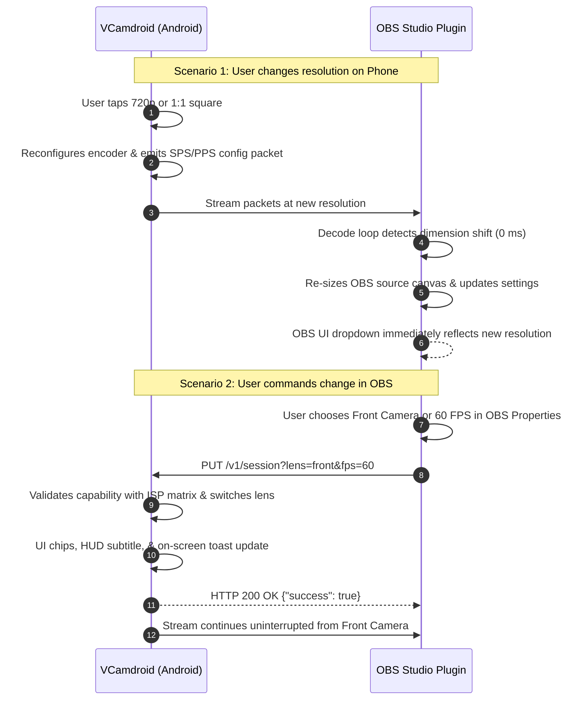

# VCamdroid OBS Plugin

[](../../releases)
[](../../releases)
[](LICENSE)
[](../../actions)
[](../../releases/tag/latest)

A broadcast-grade, high-performance plugin for **OBS Studio** that pairs seamlessly with the [**VCamdroid Android App**](https://github.com/ShadowPlague21/VCamdroid).

Eliminates the legacy master/slave dynamic, establishing **true bidirectional peer-to-peer state synchronization**: adjustments made on the phone automatically update OBS in real time, and adjustments made in OBS instantly command the phone.

---

## 🚀 Key Features

* **Symmetric Peer-to-Peer State Synchronization:**
  * **Phone $\to$ OBS:** Tap a new resolution (1080p, 720p, 1440p, 4K, or custom) or switch aspect ratio on the phone; OBS instantly adopts the new dimensions without dropping the stream.
  * **OBS $\to$ Phone:** Change resolution, camera lens (Rear vs. Front), or target FPS directly from the OBS source properties dialog; the phone updates its encoder and on-screen HUD immediately.
* **Instant Dynamic Dimension Sync (0 ms Polling Delay):**
  * Frame dimensions are inspected directly within the hardware-accelerated video decode loop (`video_decode_thread`). 
  * As soon as a resolution or aspect ratio change occurs, the OBS source canvas and settings update on the very first decoded frame.
* **Support for Custom & Odd-Ball Aspect Ratios:**
  * **1:1 Square Presets:** `2160x2160`, `1440x1440`, `1080x1080`, `720x720`
  * **9:16 Vertical / Portrait (Shorts, Reels, TikTok):** `1080x1920`, `720x1280`
  * **4:3 Studio Presets:** `2880x2160`, `1920x1440`, `1600x1200`, `1440x1080`, `1280x960`, `640x480`
  * **21:9 Ultrawide Presets:** `3440x1440`, `2560x1080`
  * **Editable Resolution Dropdown:** Choose from presets or enter arbitrary custom dimensions directly. Active probed sensor resolutions from the phone are automatically registered in the dropdown.
* **Pro Studio Remote Controls in OBS:**
  * **Camera Lens Selector:** Switch between `Rear Sensor (Wide)` and `Front Sensor` directly from OBS.
  * **Target FPS Selector:** Select `Match Phone / Auto`, `60 FPS`, `30 FPS`, `24 FPS`, or `15 FPS`.
  * **Live Battery & Tally Feedback:** Real-time battery indicator with low-battery warning and automatic broadcast tally indicators (`ON AIR` program, `PREVIEW`, `IDLE`).
* **High Performance & Low Latency:**
  * Zero-copy rendering pipeline supporting hardware decoding via NVDEC, D3D11VA, VAAPI, and VideoToolbox.
  * Ultra-low latency over USB (ADB) and local Wi-Fi.
* **100% Backward Compatibility:**
  * Registers both `vcamdroid_obs` (primary) and `droidcam_obs` (legacy alias) so existing scenes and templates never break.
  * Works seamlessly with both the VCamdroid app and legacy DroidCam apps via automatic protocol fallbacks.

---

## 🛠 Installation (Windows)

### Option 1: 1-Click Automated Installer (Recommended)
1. Download or clone this repository.
2. Double-click [**`install.bat`**](install.bat).
3. The script will automatically:
   * Request standard Windows Administrator (UAC) elevation.
   * Gracefully close OBS Studio if it is running.
   * Back up any existing DLL to `droidcam-obs.dll.original.bak`.
   * Install both `vcamdroid-obs.dll` and `droidcam-obs.dll` into `C:\Program Files\obs-studio\obs-plugins\64bit\`.

### Option 2: Manual Installation
1. Download the latest binaries from the [**Releases Page**](../../releases/tag/latest):
   * `vcamdroid-obs.dll`
   * `droidcam-obs.dll`
2. Close OBS Studio.
3. Copy both `.dll` files to:
   ```
   C:\Program Files\obs-studio\obs-plugins\64bit\
   ```
4. Start OBS Studio.

---

## 🐧 Installation (Linux)

1. Download `vcamdroid-obs-linux` from the [**Releases Page**](../../releases/tag/latest).
2. Copy `vcamdroid-obs.so` to your OBS plugins directory:
   ```bash
   mkdir -p ~/.config/obs-studio/plugins/vcamdroid-obs/bin/64bit
   cp vcamdroid-obs.so ~/.config/obs-studio/plugins/vcamdroid-obs/bin/64bit/
   ```
3. Or build locally:
   ```bash
   sudo apt-get install build-essential pkg-config libobs-dev libavcodec-dev libavformat-dev libavutil-dev libswresample-dev libturbojpeg0-dev libusbmuxd-dev libimobiledevice-dev
   make
   ```

---

## 📖 Usage Instructions

### 1. Connect via Wired USB (ADB) — *Recommended for Broadcasts*
1. Connect your phone to your PC with a USB cable and enable **USB Debugging** in Developer Options.
2. In PowerShell or Command Prompt, forward the streaming port:
   ```powershell
   adb forward tcp:4747 tcp:4747
   ```
3. Open the **VCamdroid** app on your phone and tap **OBS Plugin Mode**.
4. In OBS Studio:
   * Add a **VCamdroid** (or **DroidCam OBS**) source.
   * Select **USB** or set the WiFi IP to `127.0.0.1` on port `4747`.
   * Click **Activate**.

### 2. Connect via Local Wi-Fi
1. Ensure your phone and PC are connected to the same Wi-Fi network.
2. Open **VCamdroid** on your phone and tap **OBS Plugin Mode**. Note the IP address displayed (e.g. `192.168.1.150`).
3. In OBS Studio:
   * Add a **VCamdroid** source.
   * Select **WiFi**, enter the phone's IP address, and click **Activate**.

---

## 🔄 How Bidirectional Synchronization Operates



---

## 🤝 Companion Repository

* [**VCamdroid (Android App)**](https://github.com/ShadowPlague21/VCamdroid) — The mobile broadcast app featuring manual camera controls (ISO, EV, Focus, White Balance), ISP capability matrix, sensor probe diagnostics, and OLED screen-saver streaming.

---

## 📜 License & Credits

* Licensed under the [GNU General Public License v2.0](LICENSE).
* Forked and enhanced from the original `droidcam-obs-plugin` by Dev47Apps.
